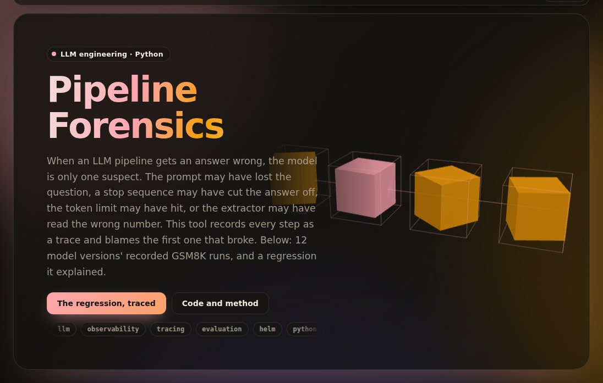

# pipeline-forensics

[](https://umer-78.github.io/pipeline-forensics/)

**Live demo:** https://umer-78.github.io/pipeline-forensics/ (every version's failures by step, and the regression a stop sequence caused)

When a multi-step AI pipeline gives a bad answer, which step broke it? This is a tracing layer and backward analyzer that answers that question.

- **Tracing.** Every run is a trace, and every step a span with input, output, timing, tokens, confidence, errors and the step's own check. It is one decorator per step, and traces are stored as JSON and indexed in SQLite.
- **Backward analysis.** The analyzer walks back from a bad output and blames the earliest step whose check failed; everything after it is a symptom.
- **Feedback.** Flagged failures go into a growing evaluation set.

It is measured on a real pipeline: HELM Lite's grade-school maths runs (GSM8K), replayed from the recorded requests and answers of twelve model versions.

## Results

`python -m forensics bench` (about 15 s once the data is cached). The pipeline has four steps:

1. **prompt:** the few-shot prompt, with the question in it.
2. **generate:** the model's answer, under the request's stop sequence and token limit.
3. **extract:** the final number, taken as the harness takes it: the last number in the text.
4. **score:** that number against the gold answer.

**The regression that wasn't only the model.** The regression detector flags Gemini 1.5 Flash 002 as 46 points worse than 001 on GSM8K (78.5% → 32.8%). Tracing the 488 questions that broke:

- 479 (98%) were **cut off before stating an answer**.
- 9 (2%) were extracted wrong.

The traces show why:

- 002 was run in a later HELM release whose requests stop generation at the first blank line (`"\n\n"`). 001's requests had no stop sequence.
- 002 writes its reasoning in paragraphs, so its answers end after the first one: `"It took Finley 30 minutes to cook rice."`

The comparison changed the pipeline along with the model. A regression gate that doesn't trace would have blamed the model.

**Where each version's failures come from:**

| Version | Stop sequence | Accuracy | Failures | Stopped before an answer | Token limit | Extracted the wrong number | Wrong answer (all checks passed) |
|---|---|---|---|---|---|---|---|
| gpt-4o-2024-05-13 | none | 90.5% | 95 | 9% | 16% | 5% | 69% |
| gpt-4o-2024-08-06 | none | 90.9% | 91 | 11% | 5% | 14% | 69% |
| gemini-1.5-pro-001 | none | 83.6% | 164 | 5% | 0% | 32% | 63% |
| gemini-1.5-pro-002 | `\n\n` | 81.7% | 183 | 89% | 0% | 0% | 11% |
| gemini-1.5-flash-001 | none | 78.5% | 215 | 7% | 0% | 40% | 53% |
| gemini-1.5-flash-002 | `\n\n` | 32.8% | 672 | 97% | 0% | 3% | 0% |
| gemini-1.0-pro-001 | `\n\n` | 78.3% | 217 | 4% | 0% | 3% | 93% |
| gemini-1.0-pro-002 | none | 81.6% | 184 | 5% | 0% | 9% | 86% |
| mistral-large-2402 | `\n\n` | 69.4% | 306 | 75% | 0% | 3% | 22% |
| mistral-large-2407 | none | 91.2% | 88 | 11% | 18% | 11% | 59% |
| llama-3-70b | `\n\n` | 80.5% | 195 | 3% | 0% | 6% | 91% |
| llama-3.1-70b-instruct | none | 93.8% | 62 | 2% | 5% | 0% | 94% |

- **Extraction is a real failure mode.** 40% of Gemini 1.5 Flash 001's failures and 32% of Pro 001's are answers that state the right result, such as "**Answer:** It will take Jay 5 hours to have 60 snowballs." The harness takes the last number (60) instead.
- **The stop sequence only hurts models that write in paragraphs.** Llama 3 and Gemini 1.0 Pro ran with the same `\n\n` stop and lost almost nothing to it.

**Injection test.** 200 correct GPT-4o traces each had one step broken on purpose, to check that the analyzer points at it:

| Fault injected | Traces | Failed | Blamed on the right step and problem |
|---|---|---|---|
| prompt lost the question | 200 | 200 | 200 (100%) |
| stopped before stating an answer | 200 | 140 | 140 (100%) |
| hit the token limit | 200 | 196 | 196 (100%) |
| extracted the wrong number | 194 | 194 | 194 (100%) |
| wrong answer (every check passed) | 200 | 200 | 200 (100%) |

- 60 answers truncated before their conclusion still ended on the right number, so they scored as correct: truncation isn't always a failure.
- The analyzer is rule-based, so 100% means the rules fire on real traces as intended. It is not a claim about unseen failure kinds.

## How it works

```python
from forensics.trace import Tracer, Store
from forensics.analyze import blame, flag

tracer = Tracer()
trace = tracer.start(doc="invoice-17")

@tracer.step("extract", check=lambda doc, out: "" if out.get("total") else "no total found")
def extract(doc): ...

@tracer.step("classify", check=lambda fields, label: "" if label in LABELS else f"unknown label {label}")
def classify(fields): ...

classify(extract(doc))
trace.status = "success" if good(trace) else "failure"
Store("traces/").add(trace, blamed=(blame(trace) or ("", ""))[0])
flag(trace, "wrong total", "eval_set.jsonl")          # feedback: into the evaluation set
```

- **Checks.** A check says whether a step's own output is sound, whatever happens downstream.
- **Blame.** The analyzer blames the earliest failed check. When every check passes and the output is still wrong, the fault is in content the checks can't judge, so it is blamed on the model step, with the model's confidence if it gave one.
- **Data.** HELM Lite's recorded requests, answers and questions are downloaded on first use into `~/.cache/forensics`; nothing is committed.

```bash
pip install -e '.[dev]'
pytest -q
python -m forensics bench
python -m forensics.demo    # rebuild the live demo's data in docs/
```
